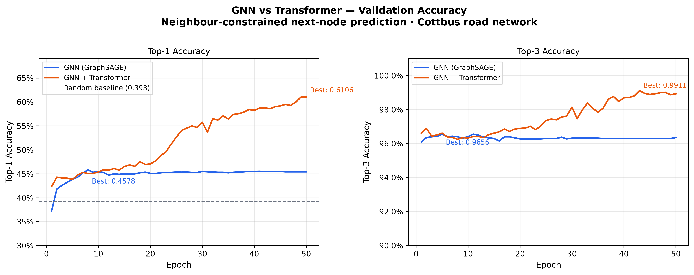

# GNN vs Transformer for Road Network Path Prediction

## Project Overview

This project compares **Graph Neural Networks (GNNs)** and **Transformer models** for next-node prediction on a real road network. Given a partial trajectory of visited intersections, the goal is to predict which road the vehicle takes next.

---

## Problem Statement

**Input:** A sequence of visited road intersections (nodes) on the Cottbus, Germany road network, extracted from OpenStreetMap.

**Output:** Which neighbour of the current node is visited next.

**Why neighbour-constrained output?**
At each intersection a vehicle can only proceed to one of 2–4 directly connected roads. Predicting the next node out of all ~2,000 nodes in the graph is both architecturally wrong and unlearnable from synthetic data — a map-matching system never considers roads that are not physically reachable. The output space is therefore constrained to the local neighbourhood, making this a realistic and learnable formulation.

**Random baseline:** ~39.3% Top-1 (expected accuracy of uniform random choice over neighbours).

---

## Results

### Main comparison

| Model | Val Top-1 | Val Top-3 | vs Random |
|---|---|---|---|
| Random baseline | 39.3% | — | — |
| GNN — GraphSAGE (spatial only) | 45.8% | 96.6% | +6.5 pp |
| Transformer seq_len=1 (no history) | 46.6% | 96.8% | +6.3 pp |
| Transformer seq_len=3 | 59.1% | 98.9% | +19.9 pp |
| **GNN + Transformer seq_len=5** | **61.1%** | **99.1%** | **+21.8 pp** |
| Transformer seq_len=7 | 57.5% | 97.8% | +18.5 pp |

The Transformer outperforms the GNN baseline by **15.3 percentage points** on Top-1 accuracy. The GNN plateaued at epoch 8 and the LR scheduler reduced the learning rate to near-zero by epoch 14 — it exhausted what spatial structure alone can provide. The Transformer was still improving at epoch 50 (loss still declining: 0.88 → 0.85), confirming the reported 61.1% is a lower bound on its true capability.

### Training curves



The plot shows two distinct learning behaviours: the GNN converges rapidly to a hard ceiling (~45.8%) imposed by its lack of temporal memory, while the Transformer continues improving throughout training, reflecting the value of trajectory context for resolving directional ambiguity at intersections.

### Sequence length ablation

Isolates whether the Transformer's advantage comes from model architecture or from trajectory history.

| seq_len | Val Top-1 | Gain over random | Training samples |
|---|---|---|---|
| 1 (no history — GNN-equivalent) | 46.6% | +6.3 pp | 71,589 |
| 3 | 59.1% | +19.9 pp | 55,638 |
| **5 (main experiment)** | **59.8%** | **+20.5 pp** | **39,721** |
| 7 | 57.5% | +18.5 pp | 23,813 |

**Key finding:** A Transformer with seq_len=1 (no trajectory history, only the current node) achieves 46.6% — nearly identical to the GNN's 45.8%. This is the control that proves the Transformer's advantage is not architectural: it comes entirely from trajectory context. The largest single gain occurs when going from seq_len=1 to seq_len=3 (+12.5 pp), meaning just 2 prior nodes are sufficient to resolve most directional ambiguity at an intersection. This has a direct practical implication for map matching: even a short GPS history window is far more informative than spatial graph structure alone.

Performance dips slightly at seq_len=7 (57.5%) due to reduced training data — longer windows leave fewer valid sliding-window samples per trajectory at walk length 10 (23,813 vs 71,589 for seq_len=1).

### Degree-stratified evaluation

Accuracy broken down by the degree of the node being predicted from — the most relevant analysis, since map matching is hardest at complex intersections.

| Node degree | Samples | % of val | GNN Top-1 | Transformer Top-1 | Delta |
|---|---|---|---|---|---|
| 2 | 296 | 6.0% | 100.0% | 100.0% | 0.0 pp |
| 3 | 116 | 2.3% | 75.0% | 81.0% | +6.0 pp |
| 4 | 351 | 7.1% | 61.0% | 73.8% | +12.8 pp |
| **4+** | **4,208** | **84.7%** | **38.5%** | **54.4%** | **+15.9 pp** |

The Transformer's advantage scales with intersection complexity. At degree-2 nodes (through-roads with a single forward option after anti-backtracking) both models achieve 100% trivially — no learning required. At degree-3 nodes the delta is +6.0 pp; at degree-4 it is +12.8 pp; at degree-4+ intersections — which comprise **84.7% of the validation set** — the Transformer outperforms the GNN by **+15.9 pp** (38.5% → 54.4%).

This is the project's most practically significant finding: trajectory history provides the greatest disambiguation benefit at exactly the intersections where map matching is hardest. A spatial GNN has no mechanism to exploit directional momentum; the Transformer does.

---

## Architecture

### GNN Baseline (GraphSAGE)

- Two GraphSAGE layers encode every road node into a 64-dim spatial embedding
- Uses only the **last visited node** as the query — no trajectory history
- Scores each candidate neighbour via dot-product with the query embedding
- Hard accuracy ceiling: cannot resolve directional ambiguity without context

### GNN + Transformer (proposed)

- Same GraphSAGE encoder produces spatial node embeddings
- A **5-node trajectory window** is embedded via GNN node lookups → `[B, T, 64]`
- Transformer encoder with **causal attention mask** reads the window → context vector
- Context vector dot-product scored against each candidate neighbour's embedding
- Both GNN and Transformer trained **end-to-end** jointly

### Pointer scoring head (shared)

Both models use the same output mechanism:

```
query_vector · candidate_embedding  →  score per candidate
masked_fill(-inf on padding)        →  CrossEntropyLoss / argmax
```

This isolates temporal memory as the single architectural variable between models, making the comparison fair.

### Architecture diagram

```
OpenStreetMap (Cottbus, Germany)
            │
            ▼
    OSMnx Graph Extraction
    2128 nodes · ~5000 edges
            │
            ▼
    7-dim Node Features
    (lat, lon, degree, road_type,
     speed_limit, in_bearing, out_bearing)
            │
     ┌──────┴──────┐
     │             │
     ▼             ▼
  GraphSAGE    GraphSAGE encoder
  (baseline)   + Transformer
     │             │
     │         [B, seq_len=5, 64]
     │             │
     │         Transformer Encoder
     │         (causal mask · 2 layers · 4 heads)
     │             │
     └──────┬───────┘
            │
     Pointer scoring head
     query · neighbour_embeddings
            │
     Logits over local candidates
     (max_degree=8, padded)
            │
     CrossEntropyLoss / argmax
```

---

## Methodology

### 1. Graph construction

Road network extracted from OpenStreetMap using OSMnx for Cottbus, Germany (`network_type='drive'`). Nodes represent intersections; edges represent driveable road segments. OSM node IDs are mapped to contiguous integer indices (0 to N−1) for embedding lookup.

### 2. Node features (7-dimensional)

| Feature | Description |
|---|---|
| `lat`, `lon` | Geographic coordinates |
| `degree` | Number of connected road segments |
| `road_type` | OSM `highway` tag encoded 0–1 (motorway=0 → track=1) |
| `speed_limit` | Normalised to 130 km/h max; OSM defaults applied where missing |
| `in_bearing` | Mean incoming road angle (cos-normalised to [−1, 1]) |
| `out_bearing` | Mean outgoing road angle (cos-normalised to [−1, 1]) |

### 3. Direction-biased random walks

Trajectories are generated using a **direction-biased random walk** with strength parameter `alpha=3.0`. At each step, candidate neighbours are weighted by:

```
weight(v) = exp(alpha × cos(heading_angle − direction_to_v))
```

A neighbour directly ahead receives weight `exp(3) ≈ 20`; a U-turn receives weight `exp(−3) ≈ 0.05`. This creates directional momentum that the Transformer can learn to exploit — unlike a uniform random walk, which contains no learnable signal.

### 4. Dataset construction

A sliding window of length `seq_len=5` is applied to each trajectory. For each window:

- **Input:** 5 node indices (the trajectory window)
- **Candidates:** padded list of neighbours of the last node (max 8, padded with −1)
- **Target:** local index (0–7) of the correct next node within the candidate list
- **Validity mask:** marks real neighbours vs padding

10,000 trajectories of length 10, split 80/10/10 (train/val/test) with fixed random seed.

### 5. Training

| Setting | Value |
|---|---|
| Optimiser | Adam, lr=0.001 |
| LR schedule | ReduceLROnPlateau (factor=0.5, patience=5, mode=max) |
| Loss | CrossEntropyLoss over local candidates |
| Gradient clipping | max norm 1.0 |
| Epochs | 50 |
| Causal mask | Upper-triangular −inf mask on Transformer encoder |

---

## Project Structure

```
project/
├── src/
│   ├── data_loader.py           # OSMnx loading, biased walks, train/val/test split
│   ├── dataset.py               # Neighbour-constrained dataset builder
│   ├── graph_model.py           # GraphSAGE with pointer scoring head
│   ├── transformer_model.py     # Transformer with pointer scoring head
│   ├── train_gnn.py             # GNN training script
│   ├── train_transformers.py    # GNN + Transformer training script
│   ├── plot_training_curves.py  # Produces results/training_curves.png
│   ├── ablation_seqlen.py       # seq_len ∈ {1,3,5,7} ablation
│   └── evaluate_by_degree.py    # Degree-stratified accuracy evaluation
│
├── notebooks/
│   ├── 01_load_graph.py
│   ├── 02_test_loader.py
│   ├── 03_generate_trajectories.py
│   ├── 04_build_dataset.py
│   ├── 05_test_gnn.py
│   └── 06_test_transformer.py
│
├── results/
│   ├── training_curves.png          # Main comparison figure
│   ├── gnn_metrics.csv              # Per-epoch GNN metrics
│   ├── transformer_metrics.csv      # Per-epoch Transformer metrics
│   ├── ablation_seqlen.csv          # Sequence length ablation results
│   ├── degree_stratified.csv        # Degree-stratified evaluation results
│   ├── gnn_best.pt                  # Best GNN checkpoint
│   └── transformer_best.pt          # Best Transformer checkpoint
│
├── requirements.txt
├── setup.py
└── README.md
```

---

## How to Run

### Install dependencies

```bash
pip install torch torch-geometric osmnx networkx numpy scikit-learn matplotlib
pip install -e .
```

### Train models

All scripts are run from the **project root** (not from inside `src/`).

```bash
python src/train_gnn.py             # GNN baseline      → results/gnn_metrics.csv        (~10 min)
python src/train_transformers.py    # GNN + Transformer → results/transformer_metrics.csv (~25 min)
```

### Generate evaluation outputs

Run after training completes. The first two are instant; the ablation takes ~40 min.

```bash
python src/plot_training_curves.py  # → results/training_curves.png
python src/evaluate_by_degree.py    # → results/degree_stratified.csv  (needs checkpoints)
python src/ablation_seqlen.py       # → results/ablation_seqlen.csv
```

---

## Limitations

- Trajectories are synthetic direction-biased random walks, not real GPS traces
- No destination or driver-intent signal modelled
- Evaluated on a single mid-size German city (Cottbus, 2,128 nodes)
- Degree-2 nodes inflate overall accuracy for both models trivially
- Transformer had not fully converged at epoch 50 — best val Top-1 is a lower bound

---

## Future Work

- Replace synthetic walks with real GPS trajectory datasets (GeoLife, OSM traces)
- Add Node2Vec or DeepWalk embeddings as an alternative to GNN spatial encoding
- Integrate temporal GNN baselines (T-GCN, STGCN) for a fuller comparison
- Extend to multi-step prediction (predict the full route, not just next node)
- Apply to the map-matching use case: given noisy GPS points, recover the most likely road sequence using the trained Transformer

---

## Tech Stack

Python · PyTorch · PyTorch Geometric · OSMnx · NetworkX · NumPy · scikit-learn · Matplotlib

---

## Author

**Hamza Majid**
MSc Artificial Intelligence — Brandenburg University of Technology (BTU) Cottbus-Senftenberg